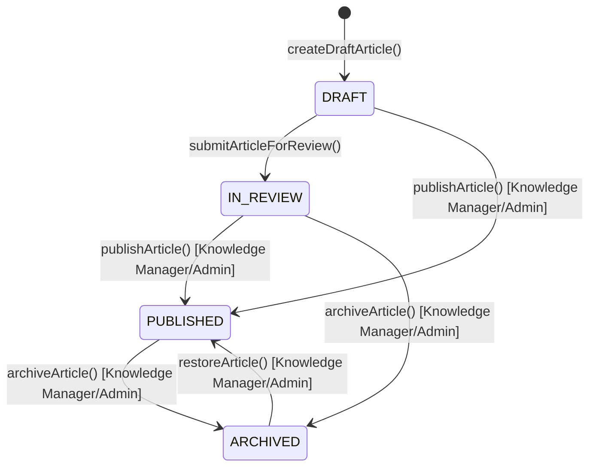

# Knowledge article lifecycle

- Only `PUBLISHED` articles are visible to customers and appear in
  pre-ticket suggestions and the chat assistant. `DRAFT`/`IN_REVIEW`/
  `ARCHIVED` are staff-only (`canViewKnowledgeArticle`).
- A Department Agent (or Triage Agent) may **create** a draft and **link**
  an existing article to a ticket, but only a Knowledge Manager or
  Administrator may **publish**, **archive**, or **restore**
  (`canPublishArticle`/`canArchiveArticle`).
- Restoring an archived article always returns it to `PUBLISHED` in this
  prototype (a documented simplification -- a production version might
  restore to whatever status preceded archival).

## Similarity / duplicate checking (before creating a new article)

1. The worker enters a proposed title/summary/tags (usually pre-filled from
   the ticket being resolved).
2. `findSimilarArticles()` (`src/lib/knowledge/similarity.ts`) searches
   **all** statuses (draft/in-review/published/archived) the worker is
   permitted to see, using the same deterministic full-text + trigram core
   as customer-facing suggestions (`src/lib/knowledge/search.ts`).
3. The search is recorded via `recordSimilarityCheck()` -- but only a
   **normalized keyword string** (`normalizeQueryText()`), never the raw
   proposed title/summary, so this audit trail can't become a secondary
   leak of sensitive ticket content.
4. The worker picks one of: link an existing article, propose an update,
   or create a new draft. Creating a new draft despite close matches is
   allowed but should include a reason in real usage (the UI surfaces the
   candidates so the worker can make an informed choice; a hard
   "must justify" gate on the create-new path is a natural follow-up
   hardening item).

## The resolution gate

See `src/lib/knowledge/resolution-gate.ts` and
`docs/TICKET_LIFECYCLE.md`. A ticket cannot become `Resolved` unless:

1. A resolution summary is entered (>= 10 chars).
2. Resolution steps are entered (>= 10 chars).
3. A knowledge similarity check has been performed **after** the
   resolution was last (re-)entered (`lastKnowledgeCheckAt >= resolutionEnteredAt`).
4. A `TicketKnowledgeLink` exists with an outcome recorded **after** that
   same point in time, one of:
   - `LINKED_EXISTING` -- an existing article answers this
   - `PROPOSED_UPDATE` -- an existing article should be updated (article
     edit itself is a separate, standard draft/review/publish flow)
   - `NEW_DRAFT` -- a new article was drafted from this ticket
   - `EXCEPTION` -- **Knowledge Manager or Administrator only**, requires a
     written reason, for resolutions that are genuinely customer-specific,
     sensitive, trivial, or otherwise unsuitable for reusable documentation

If the gate fails, the ticket stays in `RESOLUTION_REVIEW` and the UI shows
every unmet condition at once (not just the first one found).

## Drafting from a ticket

`createDraftArticle()` accepts a `sourceTicketId` and records it in
`sourceTicketIds`. The worker must still write/edit the article body
themselves -- there is no automatic copy of the raw ticket description,
customer email, attachments, or internal notes into the article. The
authoring UI reminds the worker not to include secrets, tokens, or
unnecessary personal information (Section 11.4) before submission.
