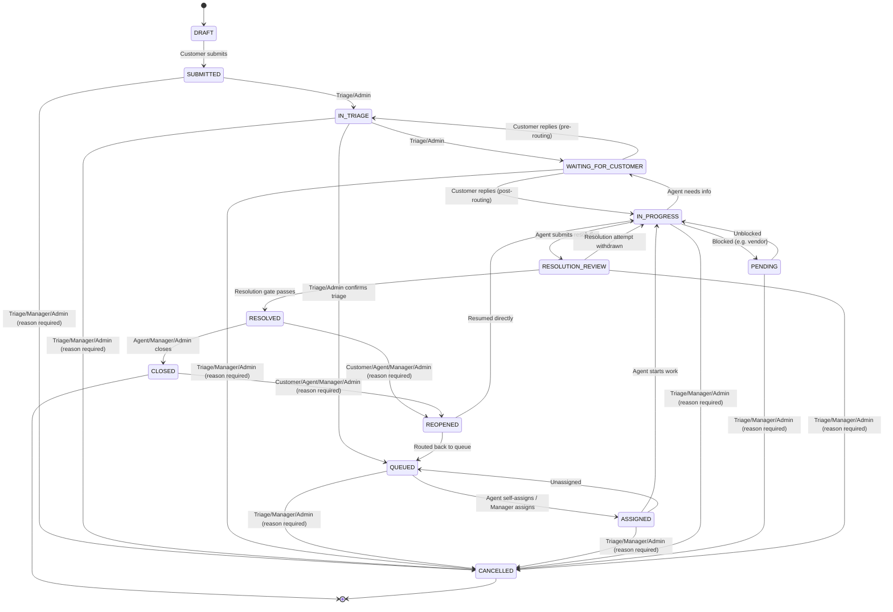

# Ticket lifecycle

Source of truth: `src/lib/tickets/state-machine.ts` (unit tested in
`state-machine.test.ts`). Department scoping (which department's agents may
act) is checked separately by `ticket-service.ts` and is not shown here.

## Notes

- **`DRAFT` is modeled but not used by the current UI.** Tickets are created
  directly in `SUBMITTED` -- there is no client-side autosave-before-submit
  flow in this prototype pass. The transition exists so a future
  autosave/draft feature has a status to land in without a schema change.
- **Reason required**: cancellation, reopen, and department transfer all
  require a non-empty reason, enforced by `assertTransition()` /
  `transferDepartment()`. The reason is stored in `TicketStatusHistory`
  (or `TicketDepartmentHistory` for transfers) and shown in the ticket
  timeline.
- **Mis-route transfer**: `transferDepartment()` can name a new assignee in
  the same call as the department change -- for the case where a ticket
  landed in the wrong department *and* with the wrong owner. The ticket's
  current assignee may initiate this themselves (not only a manager, triage
  agent, or admin, per `canTransferDepartment()`); the named assignee must
  belong to the destination department, and is emailed via the same
  mechanism that notifies customers of staff replies (`getEmailProvider()`,
  captured to `/dev-mailbox` in development). Omitting the new assignee
  keeps the original behavior: the ticket is requeued unassigned in the new
  department.
- **Resolution only via `RESOLUTION_REVIEW`**: there is no direct
  `IN_PROGRESS -> RESOLVED` transition. Submitting a resolution always
  lands the ticket in `RESOLUTION_REVIEW` first; it only continues to
  `RESOLVED` if the resolution gate (docs/KNOWLEDGE_LIFECYCLE.md) passes at
  that moment. If it doesn't, the ticket stays in `RESOLUTION_REVIEW` until
  a valid knowledge outcome is recorded and resolution is re-attempted.
- **Optimistic concurrency**: every transition requires the caller to
  supply the `version` it last read. A stale `version` produces a `409`
  (`ConflictError`), never a silent overwrite.
- **Every transition is recorded** in `TicketStatusHistory` with actor,
  timestamp, from/to status, and reason (if any) -- this is the ticket
  timeline shown on the detail page.
